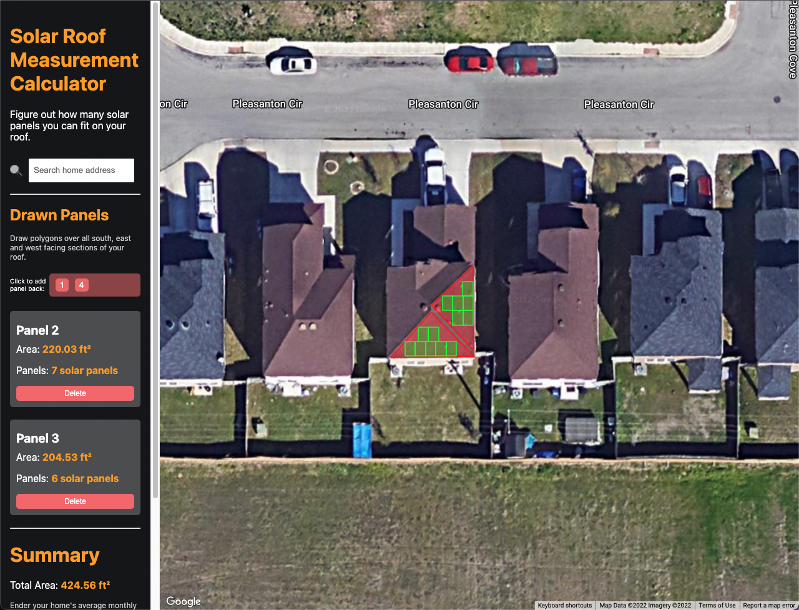
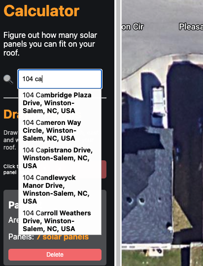
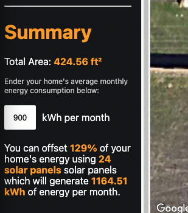

# Solar Roof Measurement Calculator

A tool to measure your roof and tell you how much of your home’s energy consumption you can offset with solar. Made with Next.JS in TypeScript and includes an extensive integration with Google Maps API. Includes a rectangle packing algorithm for triangular shaped roof panels.

**App deployed here:** https://roof-measurement-calaculator-gieetdjrk-kushagrachopra18.vercel.app/

*Note:* If you are reading this **after August 2022**, it's likely that the deployed version of the app doesn't work anymore since my free trial to the Google Maps API has ended. Feel free to check out the video below to see how it's supposed to work!

**Video demo of the app:** https://www.youtube.com/watch?v=3I8DnJDj9s4

## How to use
*Also shown in video above*

**Basic use**
1. Use the address search box to find your home
2. Highlight each south, east, and west facing panel of your roof by (for each panel):
    1. Click all of the corners of the roof panel to outline it
    2. Click the original point you placed to complete the highlight
    3. Repeat for remaining panels
3. Enter your home's monthly energy consumption in the summary section
4. View summary to figure out how much of your home's energy consumption you can offset with solar panels, how many solar panels you can fit, and how much energy that will generate per month

**Miscellaneous Features**
- Delete panels by either:
    1. Clicking on them
    2. Clicking the delete button on the corresponding block in the "Drawn Panels" section
- Add panels back by clicking the corresponding number in the "Click to add panel back:" section
- Identify panel number by hovering over panel and looking towards the top of the screen for the "Currently hovering over" popup

## Screenshots

*Solar panel packing algorithm*

*Address search feature*

*Summary section*

